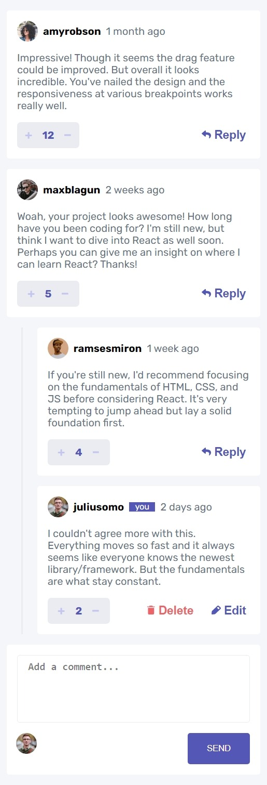

# Frontend Mentor - Interactive comments section solution

This is a solution to the [Interactive comments section challenge on Frontend Mentor](https://www.frontendmentor.io/challenges/interactive-comments-section-iG1RugEG9). Frontend Mentor challenges help you improve your coding skills by building realistic projects.

## Table of contents

- [Overview](#overview)
  - [The challenge](#the-challenge)
  - [Screenshot](#screenshot)
  - [Links](#links)
- [My process](#my-process)
  - [Built with](#built-with)
- [Author](#author)

## Overview

### The challenge

Users should be able to:

- View the optimal layout for the app depending on their device's screen size
- See hover states for all interactive elements on the page
- Create, Read, Update, and Delete comments and replies
- Upvote and downvote comments

### Screenshot

On desktop

On mobile

### Links

- Solution URL: [https://www.frontendmentor.io/solutions/interactive-comments-section-with-reactjs-M3A1VM4cDq](https://www.frontendmentor.io/solutions/interactive-comments-section-with-reactjs-M3A1VM4cDq)
- Live Site URL: [https://justgo97.github.io/comments-section/](https://justgo97.github.io/comments-section/)

## My process

### Built with

- Semantic HTML5 markup
- CSS custom properties
- Flexbox
- CSS Grid
- Mobile-first workflow
- [React](https://reactjs.org/) - JS library

## Author

- Frontend Mentor - [@justgo97](https://www.frontendmentor.io/profile/justgo97)
- Linkedin - [hamdi20](https://www.linkedin.com/in/hamdi20/)
